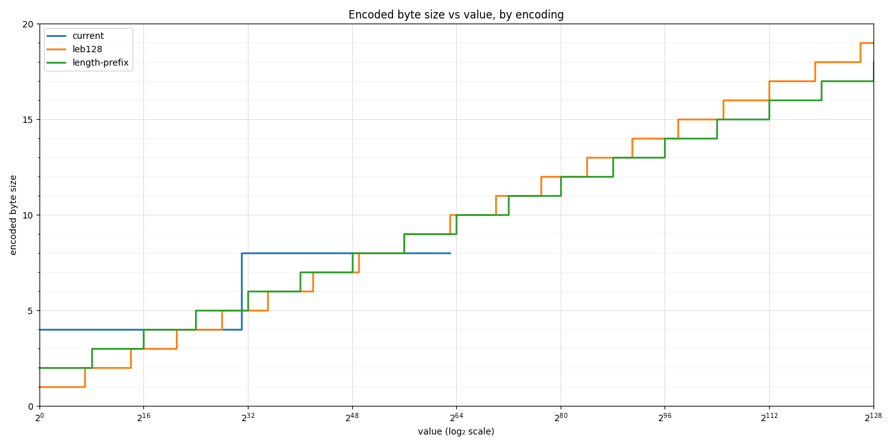
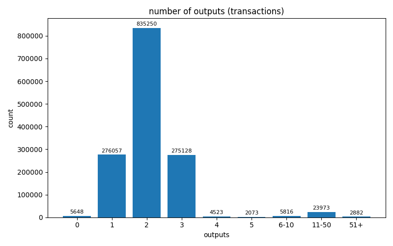
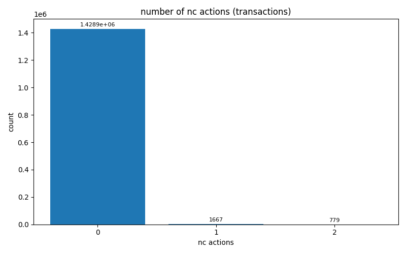
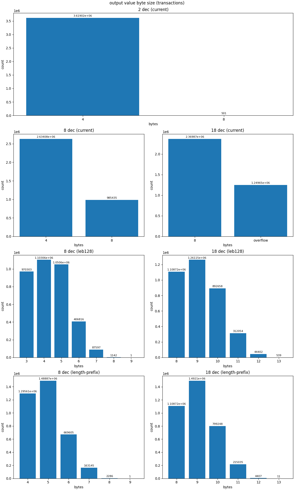

# Summary

Token value amounts on Hathor are currently stored as integers interpreted with two implicit decimal places (1 HTR = 100 base units). This document analyzes the possibility of increasing the implicit precision to 8 or 18 decimal places (matching Bitcoin's satoshi or Ethereum's wei, respectively), revisits the on-disk encoding of value fields, and estimates the storage cost of the upgrade. The change affects every place an amount is serialized: transaction outputs, Nano Contract actions, fees, balance accounting, and the logic of existing Blueprints.

The objective of this document is neither to discuss the motivation for this upgrade nor its implementation details — both will be addressed in a separate RFC. The goal here is to build intuition on how the new decimal precision could affect storage of the Hathor DAG, in order to guide an informed decision on the number of decimal places to adopt.

# The two axes

There are two partially independent axes along which we can analyze the impact of this upgrade. The first is the precision itself, that is, the number of decimal places. The second is the way output values are encoded in the network and storage layers. The two can be changed independently, but a decision on one axis influences the choice along the other.

## Current encoding

The current protocol specification encodes output values in either 4 or 8 bytes:

- Values in `(0, 2^31 - 1]` are encoded in 4 bytes (as signed positive integers).
- Values in `(2^31 - 1, 2^63]` are encoded in 8 bytes (as signed negative integers).

This means a few bytes are wasted for values at the low end of each range. It also means the maximum value this encoding supports is `2^63 = 9,223,372,036,854,775,808 base units`. With the current two decimal places, this is equivalent to `92,233,720,368,547,758.08 HTR`, or roughly 92 quadrillion HTR. The same applies to any custom token, deposit-based or fee-based; we will continue using HTR in the examples for simplicity.

Considering the first axis alone, we could increase the precision while retaining the current encoding:

- With 8 decimal places, the maximum output value would drop to `92,233,720,368.54775808 HTR`, or roughly 92 billion HTR.
- With 18 decimal places, it would drop to `9.223372036854775808 HTR`, or just over 9 HTR.

The current encoding with 2 decimal places supports an extraordinarily large number of tokens per output. For this reason, the change to 8 decimal places could be made while preserving the same encoding, at the cost of reducing the maximum value per output to ~92 billion tokens. This is likely sufficient for most use cases. The change to 18 decimal places, however, is prohibitive under this encoding, since it would allow output values of only up to ~9 tokens.

## Other encodings

To consider a new precision of 18 decimal places, or to increase precision while preserving the same maximum value per output, we must factor in the second axis and explore alternative encodings.

### Length-prefix encoding

Length-prefix encoding is a simple variable-length encoding in which the first N bytes encode a length M, and the following M bytes encode the actual payload. Using a single byte for length (`N = 1`), we can represent numbers up to 255 bytes wide — far more than required for any practical value, regardless of precision. The maximum value can be capped at any number we choose: the current ~92 quadrillion HTR, or higher round figures such as `10^17 HTR` (the closest power of ten) or `10^20 HTR`.

This encoding pays a fixed cost of one byte, which becomes more diluted as the encoded number grows. In other words, it performs well for large integers but may waste a few bytes on small ones. Even so, it outperforms the current encoding across most of the range, since the current encoding also wastes bytes, as shown below.

### LEB128

LEB128 is another variable-length encoding, already used to store integer values from Nano Contract fields in the internal global state trie. It uses one continuation bit per byte to signal when the payload ends, meaning it wastes 1 bit out of every 8. In other words, it is better than length-prefix encoding for small values, but loses for larger values once the one-byte fixed cost of length-prefix is sufficiently diluted. This relationship is explored in more detail below.

## Comparing encodings

We can plot the number of bytes consumed by each encoding as a function of the value. The values are powers of 2 representing amounts of base units. For now, we are looking only at the encoding perspective, regardless of decimal precision.

    

Note that the line for the current encoding stops at `2^63`, since that is the maximum value it supports. We plot up to the arbitrary value of `2^128` base units.

We observe that both length-prefix and LEB128 outperform the current encoding across most of its supported range, except for two bands near the upper end of each of the 4-byte and 8-byte ranges. This means that, regardless of the precision upgrade, changing the encoding alone would already save a few bytes of storage. LEB128 outperforms length-prefix up to `2^63`, where length-prefix begins to lead at 9 bytes versus LEB128's 10 bytes; from that point onward, the gap in favor of length-prefix only widens.

### Whole-token caps

The current encoding's hard cap is `2^63` base units, which at 2 decimal places represents at most `92,233,720,368,547,758 (~9.22 * 10^16)` whole tokens. Preserving that whole-token cap under a higher precision requires encoding a base-unit integer that grows by a factor of `10^6` for 8 decimal places, or `10^16` for 18 decimal places.

#### Cap of `9.22 * 10^16` (today's cap)

| precision   | base units | current bytes | leb128 bytes | length-prefix bytes |
|-------------|-----------:|--------------:|-------------:|--------------------:|
| 2 decimals  |     `2^63` |         **8** |           10 |                   9 |
| 8 decimals  |    `~2^83` |             — |           12 |                  12 |
| 18 decimals |   `~2^116` |             — |           17 |              **16** |

#### Cap of `10^17`

| precision   | base units | leb128 bytes | length-prefix bytes |
|-------------|-----------:|-------------:|--------------------:|
| 8 decimals  |    `~2^83` |           12 |                  12 |
| 18 decimals |   `~2^116` |           17 |              **16** |

#### Cap of `10^20`

| precision   | base units | leb128 bytes | length-prefix bytes |
|-------------|-----------:|-------------:|--------------------:|
| 8 decimals  |    `~2^93` |           14 |              **13** |
| 18 decimals |   `~2^126` |           19 |              **17** |

The byte counts for each encoding can be derived from the corresponding base-unit values in the comparison plot above.

At the caps, with 8 decimal places the two encodings are tied or length-prefix leads by 1 byte; with 18 decimal places, length-prefix consistently leads.

### Realistic values

The previous section analyzed the byte cost of each proposed encoding at the cap value. In practice, most outputs in the network will be far from the cap. We consider three scenarios:

1. Outputs are log-uniformly distributed in the range `[10^-8, 10^8]` tokens.
2. The majority of outputs are micro-payments, log-uniformly distributed in the range `[10^-8, 1]` tokens.
3. The majority of outputs are normal payments, log-uniformly distributed in the range `[1, 10^8]` tokens (the current pattern on Hathor).

These ranges are admittedly somewhat arbitrary. The lower bound of `10^-8` was chosen so that both precisions can be compared, since values smaller than that cannot be represented with only 8 decimal places. The upper bound of `10^8` was chosen for symmetry.

At the bounds, with precision 8:

- `10^-8` is at 1 base unit;
- 1 is at `10^8 = ~2^27` base units;
- `10^8` is at `10^16 = ~2^53` base units.

With precision 18:

- `10^-8` is at `10^10 = ~2^33` base units;
- 1 is at `10^18 = ~2^60` base units;
- `10^8` is at `10^26 = ~2^86` base units.

Mapping those values back to the comparison plot, LEB128 leads in scenario #2 for both precisions (values to the left of 1 cost fewer bytes under LEB128). In scenario #3, length-prefix leads at 18 decimal places, while LEB128 leads at 8 decimal places. In scenario #1, LEB128 leads at 8 decimal places, and the two are tied at 18 decimal places.

### Qualitative considerations

I believe length-prefix is preferable to LEB128 for UTXOs in the network and storage layers, for the following reasons:

1. **It is a simpler encoding.** It is more human-readable and therefore easier to reason about; it is also simpler to implement and verify.
2. **It offers small micro-optimization advantages.** Length-prefix allows single-pass parsing with a known allocation size (read 1 length byte, allocate, read N payload bytes). LEB128 requires a per-byte termination check and cannot pre-allocate. Skipping is also O(1) — a length-prefixed field can be skipped without inspecting its contents (useful for tooling that walks transactions without needing every field), whereas LEB128 requires scanning to find the terminator.
3. **Most importantly, canonicity is easier to enforce.** A value has exactly one encoded form if and only if two rules hold: the payload contains no leading zero bytes, and the convention for zero is fixed (e.g. `[length=0]`, rejecting `[length=1, payload=0x00]`). Both checks are local — they inspect the length byte and the first payload byte and run in constant time. Non-canonical encodings are a concern as two valid serializations of the same amount yield two distinct transaction IDs for the same semantic transaction, introducing malleability. LEB128, by contrast, admits arbitrarily long encodings of the same value by appending continuation bytes that contribute no bits (`0x05` and `0x85 0x00` both decode to 5; so do `0x85 0x80 0x00`, and so on). Enforcing canonicity then requires rejecting any encoding whose terminating byte contributes zero bits — a check that depends on reading to the end of the stream, with no upfront length bound to validate against. This is acceptable for the Nano Contract state trie implementation, which only encodes and decodes internally within a single full node, but not for network-layer data such as transaction serialization, which must be canonical across nodes.

# Storage costs

What remains is to quantify the increase in storage required to support larger output values, depending on the precision and encoding chosen. The increase depends on a few fields in storage: output values, Nano Contract action values, and fee values. The charts below show the distribution of outputs per transaction and of Nano Contract actions per transaction:

|  |  |
|-------------------------------------------|-----------------------------------------------|

Only a few thousand transactions have Nano Contract actions, whereas hundreds of thousands have one or more outputs. Fees are not currently supported on mainnet. To keep the analysis simple, we therefore consider only outputs.

Using the scripts in `./scripts`, we extracted the data below from mainnet, showing the storage size occupied by vertices and by their output values. We simulated a migration of all existing values to the new precisions and encodings, and compared the results against the current state (current encoding with 2 decimal places).

| decimals | encoding      |   vertices size (MB) | output values size (MB) | increase in vertices size |
|---------:|---------------|---------------------:|------------------------:|--------------------------:|
|        2 | current       |             6,339.28 |                   38.81 |                         — |
|        8 | current       |             6,351.07 |                   50.58 |                     0.19% |
|        8 | LEB128        |             6,346.64 |                   46.16 |                 **0.12%** |
|        8 | length-prefix |             6,349.71 |                   49.23 |                     0.16% |
|       18 | LEB128        |             6,391.33 |                   90.83 |                     0.82% |
|       18 | length-prefix |             6,389.93 |                   89.44 |                 **0.80%** |

Today, output values account for only a small fraction of vertex sizes (38.81 / 6339.28 = 0.61%). Changing the precision and the encoding of existing output values would increase the storage size of vertices by **0.82%** in the worst case. Note that the database also stores additional data, such as metadata, so in practice this percentage would be even lower relative to the total database size. The analysis excludes authority outputs; including them would reduce the figure further, since authority outputs are more compact in the proposed encodings than in the current one.

Another way to look at this is to observe the distribution of output value sizes for mainnet, for each combination of decimals and encoding:

    

All existing output values would fit in at most 13 bytes when using 18 decimal places of precision, for both LEB128 and length-prefix encodings. The genesis block contains the largest output value in the network, equal to 1 billion HTR, or `10^11` base units. With 18 decimal places, that becomes `10^27 = ~2^90` base units. Cross-checking against the first comparison plot, this value corresponds to 13 bytes for both proposed encodings, consistent with the result above.

In an estimation for the future, we can assume that most transactions will have at most 3 outputs (per the output count distribution plot) and that most output values will use at most 13 bytes. Under a pessimistic assumption where every transaction has 3 outputs, each with a 13-byte value, each transaction accounts for 39 bytes in output value sizes. For 1 million transactions, that totals 39 million bytes, or **39 MB**. Mainnet currently holds ~1.5 million transactions. Even in this pessimistic scenario, with unrealistically large output values, an additional 10 million transactions over the next year would only increase full node storage by only 390 MB.

# Conclusion

The previous section established that increasing the number of decimal places has little impact on the storage size of full nodes. This frees us to choose the precision based primarily on business needs. On that basis, 18 decimal places appears to be the right choice: it simplifies compatibility with EVM bridges and stablecoin integrations, and it future-proofs the protocol against the prospect of having to migrate from 8 to 18 decimal places at a later stage. For the encoding, given the analysis for 18 decimal places and the qualitative considerations above, length-prefix seems to be the best choice.

Therefore, **my recommendation is to adopt 18 decimal places together with length-prefix encoding of output values.**

# Bonus

Hathor's base unit needs a name, analogous to satoshi for Bitcoin, wei for Ethereum, and lamport for Solana. A few candidates:

- Egyptian mythology: 1 sistrum, 1 menat, 1 horus, 1 ankh, 1 lotus;
- Hathor creator tribute: 1 salhab, 1 brogli;
- Location tribute: 1 rio.
