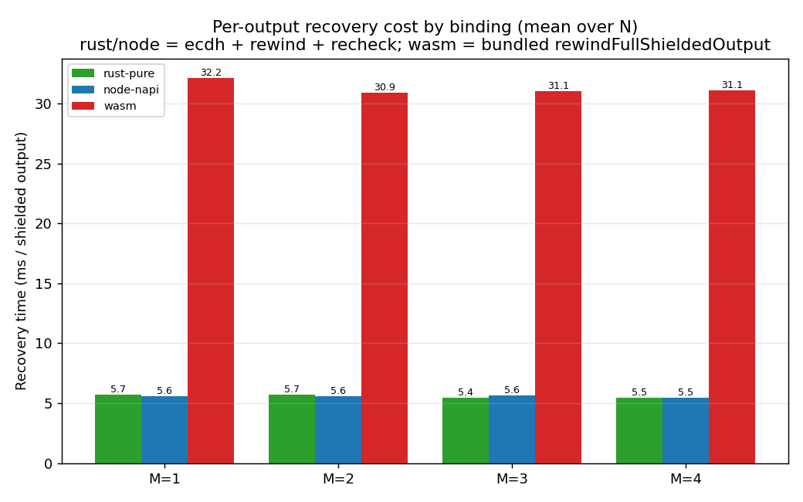
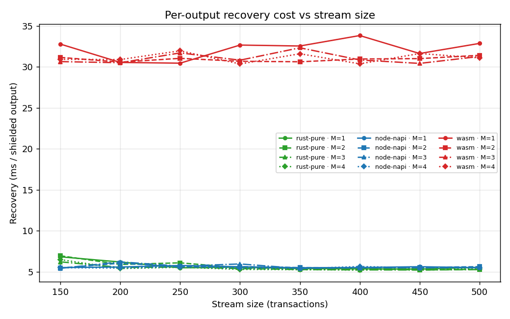
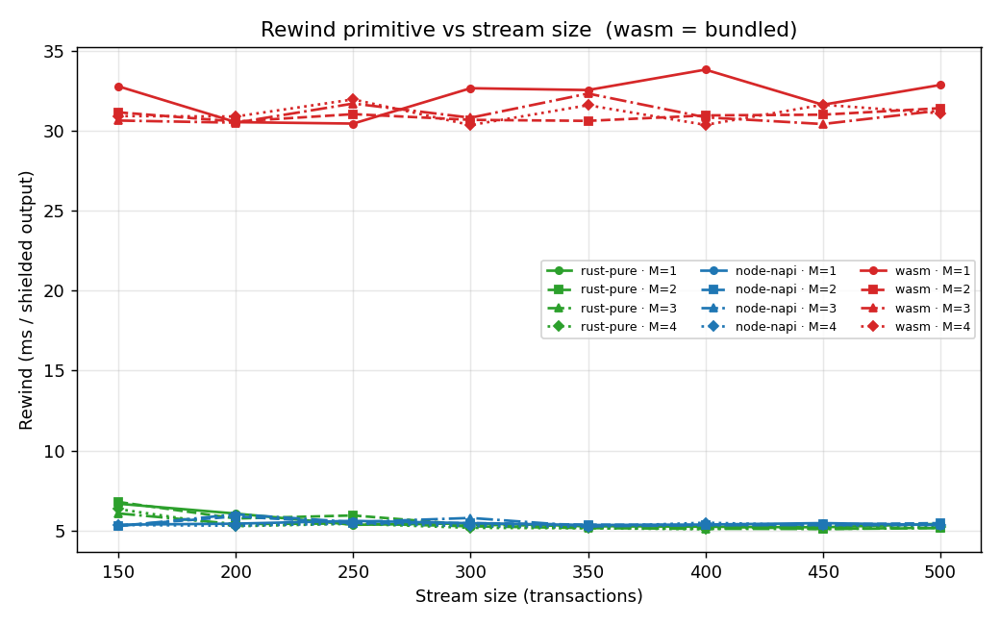
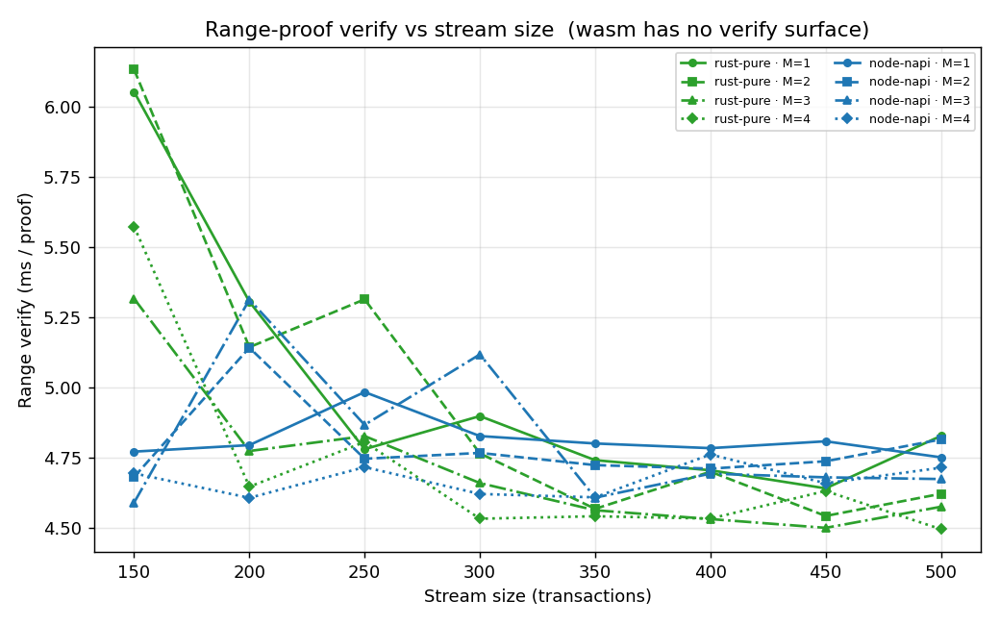
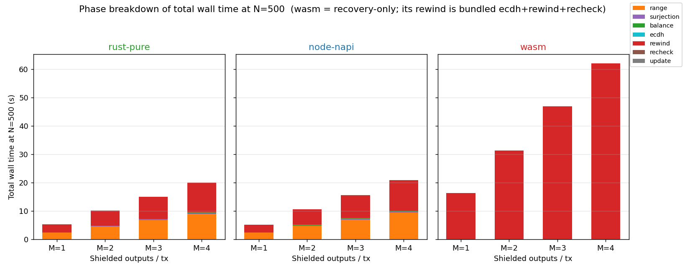
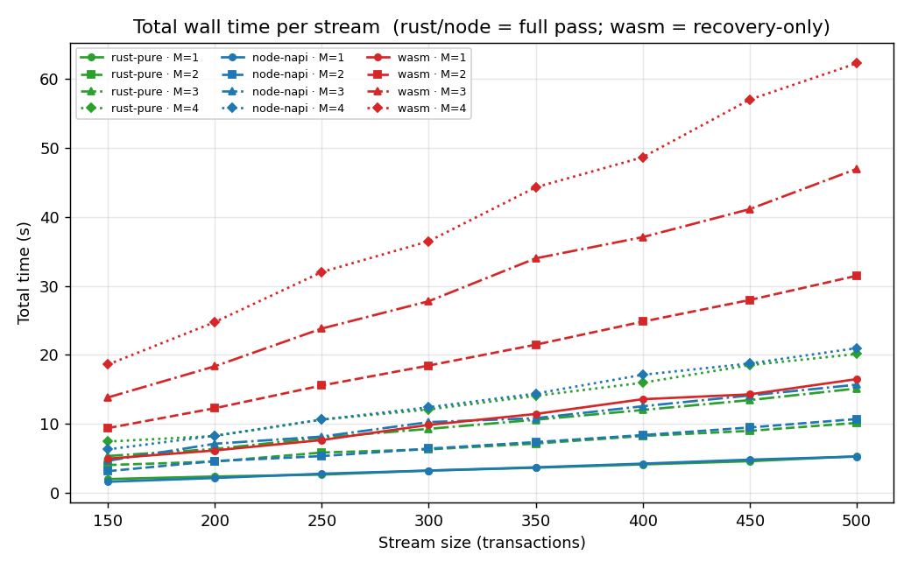
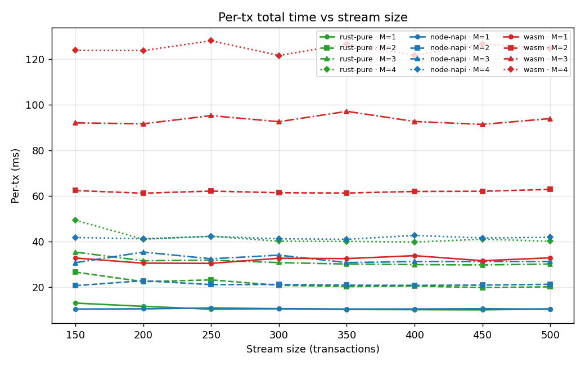
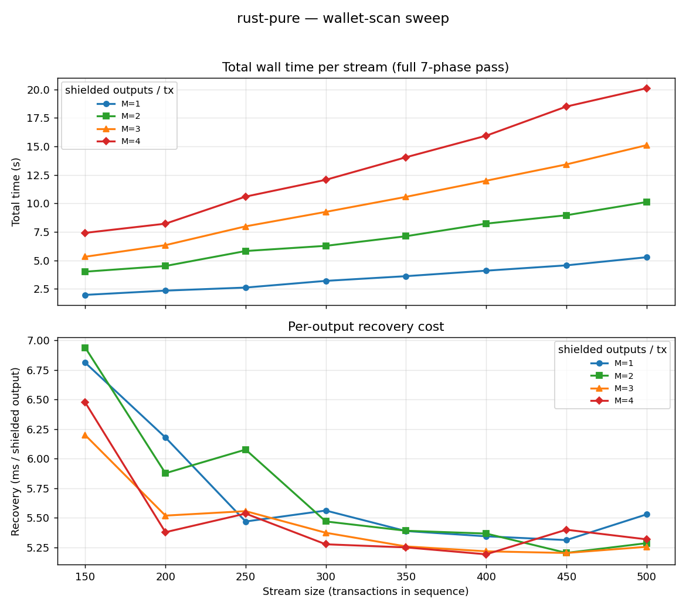
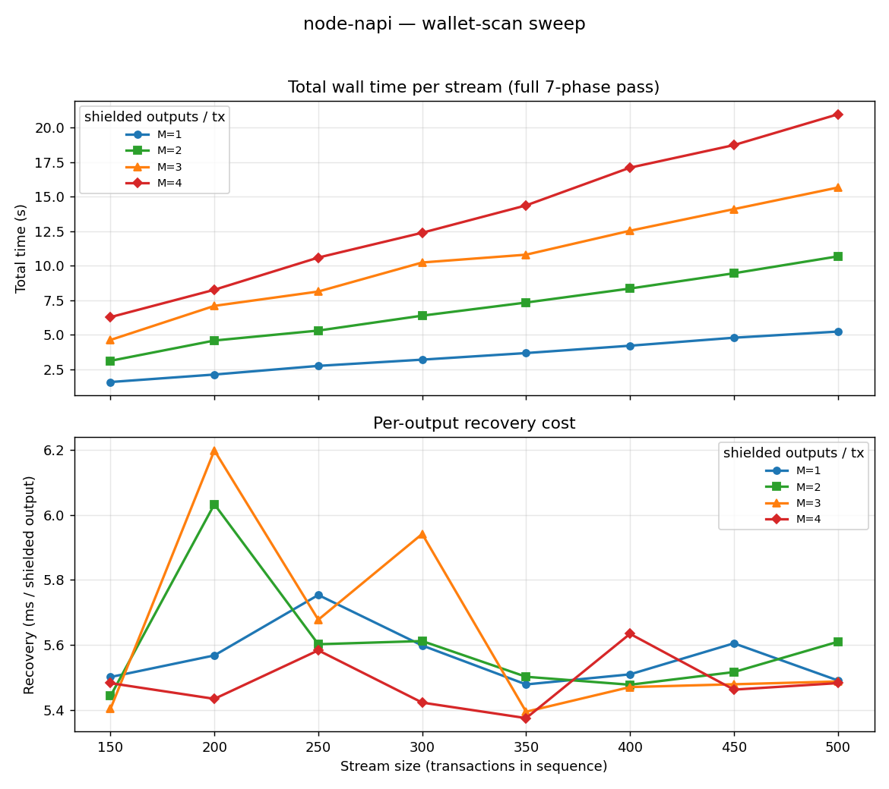
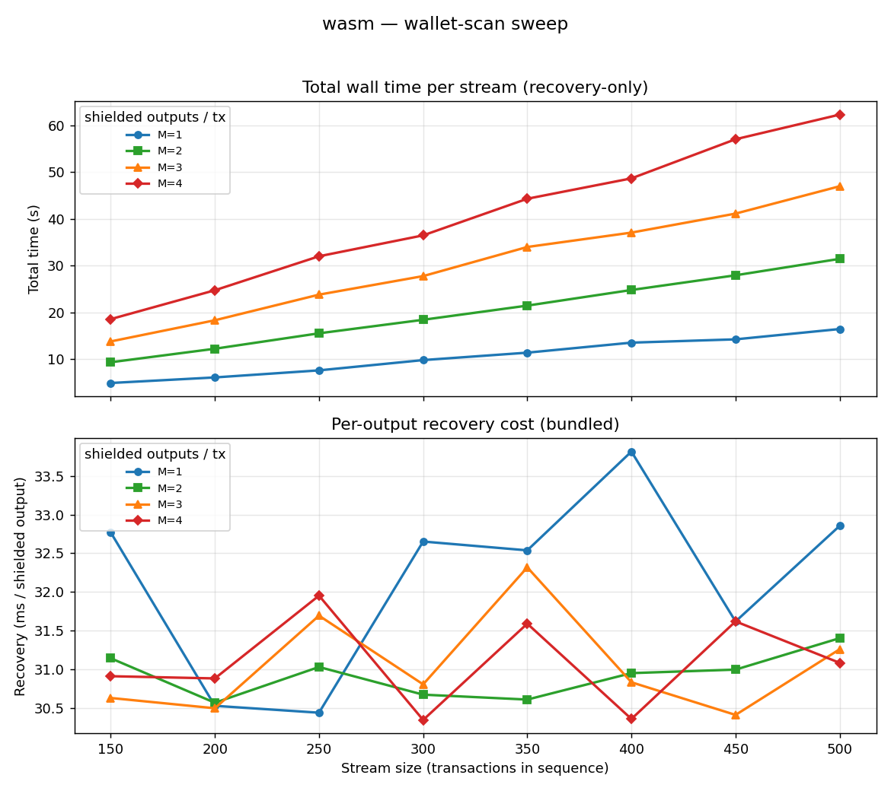

# Wallet-Scan Binding Sweep — Report

Cross-binding performance of the Hathor shielded-output **wallet scan** (recover +
validate shielded outputs from a stream of transactions), comparing the crypto
stack run three ways:

- **`rust-pure`** — the `hathor-ct-crypto` crate called natively (no FFI/runtime).
  The zero-overhead baseline.
- **`node-napi`** — `@hathor/ct-crypto-node`, the NAPI native addon (Node 20).
- **`wasm`** — `@hathor/ct-crypto-wasm`, the browser/wasm32 build (Node 20),
  **recovery-only** (it has no verify/create-proof surface).

Data: `results_sweep/wallet_scan.csv` (96 rows). Plots: `plots_sweep/`.

## What was run

- **Grid (Cartesian, not dot product):** stream size `N ∈ {150,200,250,300,350,400,450,500}`
  × shielded outputs `M ∈ {1,2,3,4}` → 32 cells per binding, 96 total.
- **Tx shape per cell:** `M` shielded (FullShielded) outputs + `M` transparent
  inputs; no shielded inputs, no transparent outputs. Single token (HTR).
- **Amount width `k = 63`.** k=64 is not usable here: the range proof uses
  `min_value=1`, so a top-bit-set 64-bit amount overflows (`min_value + 2^64`) and
  proof generation fails. At `M'=M` (no budget split) the M=1 amount is the whole
  budget, so k must stay ≤ 63.
- **`runs = 1` per cell.** Each cell still averages over `N` transactions, but
  single-run cells carry visible noise (see Caveats).
- The **wasm** binding times only the recovery pass (its sole capability); its rows
  record `total_inputs = 0` because recovery never touches inputs. For wasm, the
  one timed call `rewindFullShieldedOutput` **bundles** ECDH + rewind + the internal
  AUDIT-C015 recheck, so its "rewind" column is the whole per-output recovery.

## Headline numbers

| Metric | rust-pure | node-napi | wasm |
|---|---|---|---|
| Recovery (ms / shielded output), mean | **5.58** | **5.57** | **31.31** |
| → throughput (outputs/s) | ~179 | ~180 | ~32 |
| Range-proof verify (ms / proof), mean | 4.85 | 4.77 | — (no verify) |
| Per-output recovery vs rust-pure | 1.00× | **1.00×** | **5.61×** |

Recovery component split (rust-pure, ms/output): `rewind 5.47` + `ecdh 0.049` +
`recheck 0.059`. The rewind primitive is ~98% of recovery; native ECDH is
negligible (contrast Python's `cryptography`-lib ECDH at ~1 ms/output).

**Two takeaways up front:**

1. **node-napi ≈ rust-pure.** The NAPI marshalling overhead is unmeasurable against
   the ~5 ms native crypto — a Node service using the native addon pays essentially
   nothing versus pure Rust.
2. **wasm is ~5.6× slower** on the recovery primitive. This is not marshalling — it
   is the secp256k1 field/group arithmetic executing as wasm32 instead of native asm.

---

## Plot-by-plot

### 1. `recovery_overhead_bar.png` — the headline

Grouped bars of mean per-output recovery cost (averaged over N), grouped by M.
rust-pure and node-napi sit together at **5.4–5.7 ms** across all M; wasm towers at
**30.9–32.2 ms**. The ratio is flat in M (5.4–5.7×), because recovery is a per-output
operation — adding more outputs per tx multiplies the count, not the unit cost. This
is the cleanest single picture of the binding overhead.

### 2. `recovery_per_output_ms.png` — recovery vs N (all bindings × M)

The per-output recovery cost is **flat in N**, as it should be: three horizontal
bands — wasm at ~31 ms, rust-pure and node-napi overlapping at ~5.5 ms. The wasm band
is visibly noisier (runs=1; the bundled call is the only timer, so per-cell variance
shows). The only systematic wrinkle is a small **rust-pure bump at N=150** (~6.6 ms vs
~5.3 ms at N≥300) — a cold-start/CPU-warmup artifact of the smallest, fastest cells;
it disappears by N=300. node-napi does not show it (the Node process warms up before
the timed loop). Conclusion: recovery unit cost is a per-output constant, and the
binding identity (rust vs node) does not move it.

### 3. `rewind_per_output_ms.png` — the rewind primitive alone

Essentially identical in shape to plot 2, because `rewind` *is* recovery (the ECDH +
recheck slivers are sub-0.1 ms). rust/node ≈ 5.4 ms, wasm ≈ 31 ms. This isolates the
claim that the gap lives in the **range-proof rewind** (the heavy secp256k1 op), not
in glue code.

### 4. `range_verify_per_proof_ms.png` — verify side (rust vs node only)

Range-proof *verification* costs **~4.6–4.9 ms/proof** for both rust-pure and
node-napi; the green and blue curves interleave with no consistent winner — again,
NAPI overhead is in the noise. The pronounced spike at **N=150 (up to ~6.1 ms)** is the
same warmup artifact as plot 2, settling to ~4.7 ms by N≥350. Verify (~4.85 ms) is a
touch cheaper than rewind (~5.47 ms): both are secp256k1 rangeproof operations, and
rewind does slightly more work (decrypt + recover the embedded message). wasm is
absent — it cannot verify proofs.

### 5. `phase_breakdown.png` — where the wall time goes (stacked, at N=500)

One panel per binding, total wall time decomposed into phases.

- **rust-pure / node-napi** are nearly twins: each bar splits roughly in half between
  **range** (orange) and **rewind** (red), with hairline `ecdh`/`recheck`/`balance`/
  `surjection`/`update` slivers. M=4 reaches ~20 s; the composition is identical, only
  the height scales with M.
- **wasm** is a single red block (bundled recovery) and is **~3× taller** than the
  others at the same M — despite doing *strictly less work* (recovery only, no verify).
  That is the whole story in one image: wasm omits the verify half entirely yet still
  costs 3× more, because its one operation is 5.6× slower.

### 6. `total_time_s.png` — total wall time vs N (all bindings × M)

Every curve is **linear in N** (fixed per-tx cost × N). The curves fan by M (more
shielded outputs ⇒ steeper). The wasm family (red) sits well above rust/node (which
overlap) at equal M. Concrete endpoints at **N=500**:

| | M=1 | M=2 | M=3 | M=4 |
|---|---|---|---|---|
| rust-pure (full pass) | 5.27 s | 10.11 s | 15.10 s | 20.11 s |
| node-napi (full pass) | 5.23 | 10.67 | 15.66 | 20.96 |
| wasm (recovery only) | 16.46 | 31.46 | 46.97 | 62.27 |

Note wasm's *recovery-only* M=4 (62 s) dwarfs rust/node's *full 7-phase* M=4 (~20 s).

### 7. `per_tx_total_ms.png` — per-tx time vs N

The same data normalized per transaction, so the curves go **flat in N** (confirming
linear totals) and separate cleanly into bands by (binding, M). At N=500:

- rust-pure / node-napi: M=1 ≈ 10.5 ms, M=4 ≈ 40–42 ms (≈ M × ~10 ms/output).
- wasm: M=1 ≈ 33 ms, M=4 ≈ 125 ms (≈ M × ~31 ms/output).

This is the most useful plot for capacity planning: read off ms/tx for a shape, divide
1000 by it for tx/s.

### 8. `sweep_rust-pure.png` — the baseline in detail

Two stacked panels (curves per M). **Top (total time):** clean linear-in-N fans;
M=4 reaches ~20 s at N=500, M=1 ~5.3 s. **Bottom (recovery ms/output):** flat at
~5.2–5.5 ms for N≥250, with the N=150 cold-start bump (all M elevated to 6.2–6.9 ms)
clearly visible. This is the zero-overhead reference every other binding is measured
against.

### 9. `sweep_node-napi.png` — the native addon

Visually indistinguishable from rust-pure: same linear totals (M=4 ~21 s at N=500),
same flat ~5.5 ms recovery floor, *without* the N=150 bump (Node JITs/warms before the
timed loop). The takeaway is the non-event: **going through NAPI costs nothing
measurable.**

### 10. `sweep_wasm.png` — the browser build

**Top:** linear totals, but on a far steeper scale (M=4 ~62 s at N=500) for *less*
work. **Bottom:** recovery hovers ~30.5–33.8 ms with no N trend — just runs=1 scatter
around the ~31 ms mean. The flatness confirms wasm's penalty is a fixed per-output
multiplier, not something that compounds with stream size.

---

## Overheads — interpretation

| Source of overhead | Magnitude | Why |
|---|---|---|
| **NAPI (node-napi vs rust-pure)** | ~0% (≤ noise) | Same native libsecp256k1-zkp; one FFI hop per call is trivial against ~5 ms of crypto. |
| **wasm (vs rust-pure)** | **~5.6×** on recovery | The rangeproof rewind runs as wasm32 — no native field-arithmetic asm/SIMD; pure execution-engine cost, not marshalling. |
| **ECDH binding (historical note)** | native ~0.05 ms vs Python `cryptography` ~1 ms | Not in this sweep, but explains why the earlier python-ffi path spent ~1 ms/output on ECDH that vanishes natively. |

The verify and rewind primitives are the cost centers (~4.85 and ~5.47 ms); everything
else (ecdh, recheck, balance, surjection on a 1-element domain, balance-update) is
sub-0.1 ms and invisible in the stacks.

## Expected times (capacity planning)

Per-output / per-proof unit costs (use these; they're N-independent):

- **rust-pure / node-napi**, full verify+recover per shielded output ≈
  `range 4.85 + rewind 5.47 + ecdh/recheck/etc ~0.15` ≈ **~10.5 ms/output**
  (⇒ ~95 outputs/s; per tx ≈ `M × 10.5 ms`).
- **wasm**, recovery per output ≈ **~31 ms/output** (⇒ ~32 outputs/s; per tx ≈
  `M × 31 ms`).

Linear extrapolation (totals scale with `N × M`):

| Workload | rust-pure / node-napi | wasm (recovery only) |
|---|---|---|
| 1,000 tx × M=1 | ~10.5 s | ~31 s |
| 1,000 tx × M=4 | ~42 s | ~125 s |
| 10,000 tx × M=4 | ~7 min | ~21 min |

So a native (Rust or Node-addon) full node/wallet recovers + verifies a 1k-tx,
4-output-each stream in well under a minute; a browser/wasm auditor doing only the
recovery half takes ~2 minutes for the same stream, and that gap grows linearly.

## Caveats

- **runs=1.** Cell-level noise is real (e.g. the N=150 warmup bump, wasm's ±2 ms
  scatter). Trends across the 8 N points are robust; individual cells are not. Re-run
  with `--runs 3` to tighten.
- **wasm is recovery-only.** Its totals are not comparable to rust/node totals
  phase-for-phase — only the recovery (rewind) numbers are apples-to-apples. Its rows
  carry `total_inputs=0`; the "M transparent inputs" only affect rust/node (range +
  balance verify).
- **k=63, not 64** (rangeproof `min_value=1` ceiling). Cost is essentially the same as
  k=64 would be; it is purely a representability constraint.
- **Single machine, WSL2.** Absolute ms are hardware-specific; the *ratios*
  (node≈rust, wasm≈5.6×) are the portable result.

---

*Regenerate:* `python3 sweep_wallet_scan.py --node <nvm node18+>` →
`python3 plot_sweep.py` + `python3 plot_sweep_shapes.py` →
`python3 summarize_sweep.py`. *PDF:* `python3 ../_render_md_to_pdf.py SWEEP_REPORT.md SWEEP_REPORT.pdf`.
