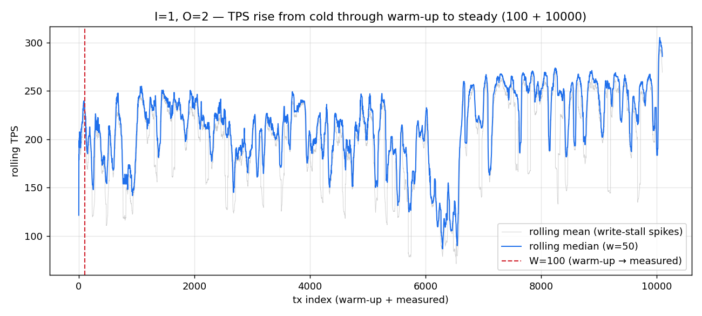
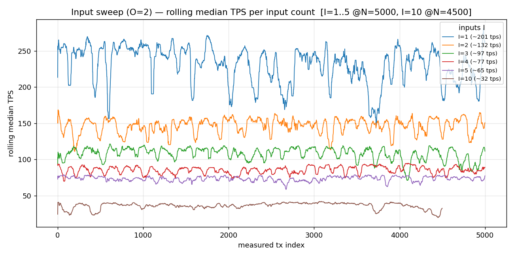
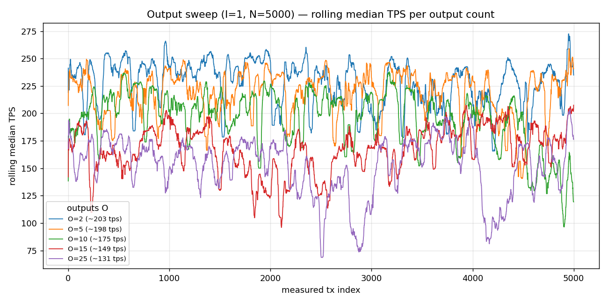

- Feature Name: fullnode_tps_benchmark
- Start Date: 2026-06-02
- RFC PR:
- Hathor Issue:
- Author: Luis Felipe Silva Rezende Soares <lfsrsprofessional@gmail.com>
- Status: **Phase 1 — implemented and measured** (this RFC reports the built engine and its baseline results)

# Summary
[summary]: #summary

This RFC documents a small, modular benchmarking engine — `hathor_tps_bench` — that measures how fast a
single Hathor full node can *process* the transactions it receives. Instead of talking to the node over
the network, the engine runs inside the same Python process as a real `HathorManager`, builds a batch of
valid transparent transactions with hathor-core's own `DAGBuilder`, and feeds them one at a time through
the node's vertex-processing pipeline — from deserialization through verification, storage, and consensus
— while timing each step and sampling the node's resource usage. The output is a single, defensible
**transactions-per-second** figure for node processing, broken down by pipeline stage, with plots and
CSV/JSON.

On the reference machine (Intel i5-11300H, single thread) the node processes a baseline 1-input /
2-output transparent transaction at **≈ 215 tx/s (≈ 4.7 ms/tx)**, dominated not by any single stage but
by **full verification performed twice** (once in S3+S4, again inside post-consensus) together with
consensus bookkeeping. Inputs are expensive (≈ 2.6 ms each, roughly linear); outputs are cheap. With a
representative tip-confirming workload, per-transaction cost is **bounded** in batch size — unlike a naïve
genesis-parented workload, which degrades as O(N²). The number is a single-thread processing ceiling that
**must be scaled to other hardware**. The engine is built so that other transaction types and other cost
sources (wallet, relay, confirmation) plug in later as opt-in modules.

# Motivation
[motivation]: #motivation

A recurring question about any blockchain is deceptively simple: *how many transactions per second can it
handle?* The honest answer is "it depends which part of the system you mean." A wallet emitting
transactions, the peer-to-peer network relaying them, and the full node validating and storing them are
three different bottlenecks with three different ceilings. This project isolates the one that sets the
hard limit on single-node capacity: **the full node's ability to accept and process a transaction once it
arrives** — and, by extension, what that implies for the Hathor Network as a whole.

We pursued this for three reasons:

1. **A trustworthy ceiling.** When a node receives a transaction it performs a fixed amount of CPU-bound
   work on a single thread (deserialize, verify signatures, run consensus, write to RocksDB). That
   per-transaction cost caps single-node throughput, and we wanted to *measure* it rather than guess.
2. **Bottleneck discovery.** A per-stage breakdown reveals whether the time goes to signature
   verification, consensus bookkeeping, or storage — and confirms or refutes specific suspicions. (Our
   earlier code study flagged that full verification appears to run *twice* per accepted transaction; the
   measurements confirm it.)
3. **A reusable, repeatable tool.** Not a one-off script, but an engine we can re-run as the code evolves,
   point at different transaction shapes, and extend to nano contracts, fee tokens, and shielded outputs.

The concrete Phase-1 outcome is a reproducible run that emits a headline processing-TPS figure, a
per-stage latency profile, a batch-level resource summary (memory, disk I/O, file descriptors), and the
charts to back them up.

# Guide-level explanation
[guide-level-explanation]: #guide-level-explanation

Think of the engine as a test bench for the part of the node that handles an incoming transaction. This
section walks through what that means, one idea at a time.

## 1. What we benchmark

We measure **the node, not the network.** Rather than fire HTTP requests at `push_tx` — which would
measure the web server, the OS network stack, and round-trip latency, none of which we care about — the
engine stands up a **genuine node in the same Python process**. It uses hathor-core's own test `Builder`
to construct a real `HathorManager` with **real RocksDB storage** and the **real verification and
consensus code**; the network is set to `unittests` and the difficulty-adjustment is put into a test mode
that sets every weight to 1. From the node's point of view nothing is faked.

How to *read* the resulting number: it is the node's **processing ceiling on a single thread**, measured
in isolation. It is deliberately not the wallet's emission rate, not the network's relay rate, and not how
fast blocks confirm — those are separate questions the engine is designed to grow into. Because the node
processes transactions one at a time on a single reactor thread, throughput is essentially the reciprocal
of per-transaction processing time: the way to make the node faster is to make each transaction cheaper,
not to push more in parallel.

## 2. A transaction's journey in a node

When a transaction reaches the node it flows through a fixed pipeline of six steps. We give them stable
names so we can talk about them and chart them; every number we report is attributed to one of them.

- **S1 — Deserialize.** Raw bytes become a vertex object (`vertex_parser.deserialize`).
- **S2 — Pre-checks.** The cheap rejects: already known? double-spend? spending a voided transaction?
  spending a still-locked block reward?
- **S3 + S4 — Verify.** The substantive work: proof-of-work is *checked* (not solved), every input
  signature is validated, and inputs must balance outputs (`VertexHandler._validate_vertex` →
  `validate_full`).
- **S5 — Save & Consensus.** The transaction is written to RocksDB and woven into the DAG: inputs are
  marked spent, voided-status is propagated, the **mempool-tips index** is updated, indexes are refreshed
  (`_unsafe_save_and_run_consensus`).
- **S6 — Post-consensus.** Indexes and events are finalised — and, crucially, **`validate_full` runs a
  *second* time** (`_post_consensus`), so verification effectively happens twice per accepted transaction.

The engine's whole job is to drive a transaction through S1–S6 and record how long each stage took and
what it cost.

## 3. Workload

We describe what we want to push through — "N transparent transactions, each with `I` inputs and `O`
outputs" — and the engine builds exactly that with hathor-core's **`DAGBuilder`**, a test-fixture
generator that mines funding blocks and assembles valid, signed transactions of the requested shape.
Importantly, `DAGBuilder` carries its **own** signing keys and plays the role of the *sender*: the node
under test never signs anything, it only verifies — which keeps the wallet-versus-node boundary the whole
project rests on perfectly clean.

A representative batch is built in three layers:

1. **Mining coinbase blocks.** A short chain of blocks is mined off genesis; each block carries a coinbase
   reward. These exist only to *create spendable value* and to satisfy the reward-maturity rule (a
   coinbase cannot be spent until several blocks later).

2. **Funding transactions → inputs and outputs.** A small set of `fund` transactions consolidates the
   coinbase value and fans it into many small, fully-pinned UTXOs. Each payload transaction is handed its
   **own disjoint slice** of those UTXOs as inputs (disjoint so no two transactions double-spend), and
   emits pinned outputs whose values sum exactly to the inputs — so each transaction has *exactly* the
   requested I inputs and O outputs. The fund transactions are **chained through their change outputs**, so
   the number of coinbase blocks required grows with total *value*, not with the UTXO count.

3. **Linear DAG parent-chaining (the key correctness fix).** Every Hathor transaction confirms two
   "parents". A naïve workload lets the builder attach every transaction to *genesis*; the consequence is
   that **no transaction is ever a parent of another, so every transaction is a "tip"**, and since the
   node's consensus re-scans *all* current tips on every transaction (`mempool_tips.update` is O(tips)),
   per-transaction cost in **S5 grows linearly with the batch — an O(N²) blow-up**. We avoid this by
   **chaining the transactions in the parent DAG** (`tx_k` names `tx_{k-1}` as a parent), so each
   transaction confirms its predecessor and **only the latest is ever a tip**. The tip set stays at ≈ 1,
   `mempool_tips.update` becomes O(1), and S5 is flat. (The fund transactions are likewise parent-chained,
   to keep genesis from accumulating more children than a one-byte counter can hold.)

The structure of the assembled workload, and the two edge types that connect it:

```text
 LEGEND     ═══▶ spend  (consumes a UTXO — an input)        ──▶ parent  (confirms a vertex)

 (1) BLOCKS — mined off genesis to create coinbase value
       genesis ──▶ b1 ──▶ b2 ──▶ ··· ──▶ bn            (each  bi.out[0] = a coinbase reward)

 (2) FUNDS — consolidate the coinbases, fan the value into many small pinned UTXOs, and
             CHAIN through each fund's change output (so only a few blocks are needed)
       b1.out[0] ═╗
       b2.out[0] ═╬═══▶ fund0 ══change══▶ fund1 ══change══▶ ··· ══change══▶ fundM
          ···    ═╝       │                  │                                │
                      mints UTXOs        mints UTXOs                      mints UTXOs
                      out[0..199]        out[0..199]                      out[0..199]

 (3) PAYLOAD — each  txk  spends its OWN disjoint fund UTXOs (inputs) AND names the
              previous tx as a parent.  (Parent arrows point from a tx to its parent.)
                          fundF.out[k]
                               ║ spend
                               ▼
       genesis ◀── tx0 ◀── tx1 ◀── tx2 ◀── ··· ◀── tx(N-1)        ◀═══ the ONLY tip
                  (tx0,tx1     each tx confirms its predecessor
                   seed on     ⇒  tips ≈ 1  ⇒  mempool-tips scan is O(1)  ⇒  S5 stays flat
                   genesis)

 ── the pathology we AVOID ───────────────────────────────────────────────────────────
   If every tx parented GENESIS instead of the previous tx, then NO tx is anyone's
   parent ⇒ ALL N transactions are tips ⇒ the tip scan is O(N) ⇒ the batch costs O(N²):
       genesis ◀── tx0 , tx1 , tx2 , ··· , tx(N-1)     (a flat fan of N tips)
```

**A word on proof-of-work.** Every Hathor transaction carries a **weight**, and the node accepts it only
if the weight meets a minimum derived from the transaction's size and amount. "Mining" a transaction means
searching for a nonce whose hash clears that target — and it is the *sender's* job, done before submission.
The node never mines an incoming transaction; it only *verifies* the proof-of-work. We run the node in
test mode with every weight set to 1, for one practical reason and one principled reason. The practical
reason is setup speed: finding a valid nonce at a realistic weight is deliberately expensive, and at weight
1 it is effectively instant — and this happens entirely in the build phase, *outside* the timed loop. The
principled reason is that it does not bias the result: verifying proof-of-work is a single constant-time
hash comparison, independent of the weight value, and no other stage scales with it.

## 4. Types of measurement

Not everything can be measured the same way, so the engine uses a different strategy per quantity.

**Time** is authoritative, per-stage and per-transaction. We wrap each stage and read a high-resolution
clock before and after (`perf_counter_ns` for wall time, `process_time_ns` for CPU time). Two clocks are
kept because their difference reveals any time lost to I/O wait rather than computation — and throughout,
**wall time ≈ CPU time**, confirming the path is CPU-bound (no idle I/O wait), which validates the timing.

**Memory, disk I/O, and file descriptors** are different animals. Memory does not change neatly per
transaction; RocksDB writes are *deferred* to a background flush; FD counts barely move between
transactions. So for these three we trust the **batch** view: a background sampler reads Linux `/proc` to
capture resident set size (RSS), real block-device read/write bytes, and open-FD counts over time, and we
report totals and peaks across the batch (with a `flush()` at the boundary so deferred writes are counted).

## 5. An example

A Hathor dev writes `N=500, I=1, O=2` (or passes the equivalent flags) and runs the engine. It boots a
throwaway node, funds the workload, builds 500 single-input/two-output transactions, and feeds them
through S1–S6 on one thread, recording per-stage timings for every one and watching resource usage across
the batch. From the dev's side it is a single command; everything else is automatic and reproducible.

## 6. Visualizing

When the run finishes it writes a timestamped run folder with a `summary.md` (the headline number plus a
per-stage table), a per-stage latency chart, a per-tx latency histogram, a rolling-throughput curve
(transient → steady, mean faint + median bold), and a cumulative-time `C(N)` chart. Sweeps add overlaid
per-variant curves. The dev opens the summary and immediately sees both things that matter: the ceiling
(how many tx/s) and where the time went (which stage dominates).

# Reference-level explanation
[reference-level-explanation]: #reference-level-explanation

The engine rests on a small number of load-bearing facts:

1. The unit of measurement is **one vertex travelling through the node's processing pipeline**, divided
   into six named stages, **S1–S6**.
2. Each stage is *anchored* to exactly one real function in `hathor-core`; the engine times that function
   by wrapping it and never reimplements the node's logic.
3. For a transaction the entire pipeline is **synchronous and single-threaded** — every function on the
   path returns a plain value (`bool`, `list`, `None`), never a Twisted `Deferred` (the asynchronous
   `@inlineCallbacks` path exists only for *blocks*). So a stage's cost is simply the wall-clock interval
   inside its anchor function, with no hidden continuation running later.
4. **Time** is collected per-stage and per-transaction; **memory, disk I/O, and file descriptors** are
   collected per-batch (totals and peaks) plus a background time-series, because those are too noisy to pin
   to a single stage.
5. The node under test is a **real `HathorManager`** built with the production `Builder` on real RocksDB
   storage. Only two things differ from a mainnet node: proof-of-work difficulty is the trivial test weight
   (1), and the network is absent.

To time the stages individually, the driver **replays the node's own internal processing chain by hand**
(`VertexHandler._old_on_new_vertex`): deserialize (S1), run the manager pre-checks (S2), then call
`_validate_vertex` (S3+S4), `_unsafe_save_and_run_consensus` (S5) and `_post_consensus` (S6) in order,
wrapping each in a high-resolution timer. These are the node's real functions, called in the node's real
order — nothing is mocked. Anchoring the two verification probes on the *outer* methods (`_validate_vertex`
and `_post_consensus`) rather than on `validate_full` itself is what lets the **two** verification passes
fall into different stages, so the cost of the redundant second pass is a first-class number instead of
being silently double-counted.

| Stage | Anchor function (probe site) | What is being paid for |
| :---- | :--------------------------- | :--------------------- |
| **S1** | `manager.vertex_parser.deserialize(raw)` | parse bytes into a vertex object |
| **S2** | pre-check block in `HathorManager.push_tx` | existence / double-spend / spending-voided / reward-lock |
| **S3+S4** | `VertexHandler._validate_vertex` | full verification: PoW check, **signatures**, balance |
| **S5** | `VertexHandler._unsafe_save_and_run_consensus` | RocksDB write + DAG/consensus bookkeeping + mempool tips |
| **S6** | `VertexHandler._post_consensus` | **second** verification pass + index updates + pubsub events |

The expensive work S3+S4 pays for lives one level deeper, in `VerificationService._verify_tx`:
`verify_pow` (a single comparison against the target — effectively free), `verify_inputs` (the secp256k1
signature checks and script execution — the dominant cost, growing linearly with the number of inputs
`I`), and `verify_transparent_balance` (inputs and outputs must sum correctly per token).

**Data treatment.** Two treatments make the timing trustworthy. First, a **warm-up prefix**: the first
~100 transactions are driven but their records are *discarded*, because a cold RocksDB cache and a cold
interpreter make the opening transactions unrepresentatively slow; we report the steady state. Second,
**windowed median smoothing**: roughly **0.5 % of transactions are 5–20× slower** than normal (up to
~117 ms), and these spikes are *entirely* in S5 — they are **RocksDB write-stalls** (the storage engine
periodically blocks a write while it flushes/compacts). They are real background storage cost but not the
steady per-transaction rate, so for trend curves we use a **rolling median** (default window 50, scaled to
10 % of N for small batches) which ignores the outliers, while still reporting the spike rate as tail
latency.

# Results / Findings
[results]: #results

All figures below were obtained on a single reference machine:

| Component | Specification |
|---|---|
| CPU | Intel **Core i5-11300H** (Tiger Lake, 11th gen), 4 cores / 8 threads, 3.10 GHz base / 4.40 GHz boost |
| Cores used | **One core, single thread** (the node processes vertices serially on one reactor thread) |
| RAM | **12 GB** (the benchmark's resident set stayed ≈ 100–110 MB) |
| OS | **Windows 11** host, running **WSL 2.0** (Ubuntu); Python 3.11 |
| Storage | RocksDB on a temporary directory (NVMe-backed) |

> **⚠️ Every throughput figure is specific to this hardware and MUST be scaled to the reader's own machine.**
> Processing is single-thread CPU-bound, so the rate scales (approximately linearly) with single-thread CPU
> performance, *not* core count: `TPS_target ≈ TPS_here × (single_thread_score_target /
> single_thread_score_i5-11300H)` — e.g. PassMark's *Single Thread Rating* (cpubenchmark.net).

## 5.1 Headline figure and per-stage profile

For the baseline 1-input / 2-output transparent transaction, the node's warmed, single-thread
**processing rate is ≈ 215 tx/s (≈ 4.7 ms per transaction)**. The per-stage breakdown (1-tip-transparent workload,
N = 500):

| Stage | Mean wall (µs) | Share | What dominates it |
|---|---|---|---|
| S1 Deserialize | 131 | 3 % | bytes → object |
| S2 Pre-checks | 57 | 1 % | cheap rejects |
| S3+S4 Verify | 1007 | 24 % | **1st** full verification (PoW check, signatures, balance) |
| S5 Save & Consensus | 1856 | 44 % | consensus bookkeeping + storage write + indexes |
| S6 Post-consensus | 1193 | 28 % | **2nd** full verification + indexes + events |
| **Total** | **4245** | | **→ ≈ 236 tx/s** |

The single most important structural finding: **verification runs twice** — once in S3+S4 and again inside
S6 — so verification-related work is ≈ S3+S4 plus most of S6, i.e. **roughly half the total cost**, more
than pure consensus. The redundant second `validate_full` is the most concrete optimisation target this
study identified (~1.3× on its own).

## 5.2 Throughput over time, and the effect of warm-up

Driving 100 warm-up + 10 000 measured transactions and plotting rolling throughput across the whole run:
the faint grey line is the rolling *mean* (the downward spikes are the RocksDB write-stalls); the bold line
is the rolling *median*. Throughput rises from a cold start, crosses the W = 100 warm-up boundary, and
settles into a steady regime — confirming both that the warm-up prefix is necessary and that, once warm,
per-transaction cost does **not** drift upward (it is bounded in N).



## 5.3 How transaction shape changes the rate

**Inputs (I) dominate.** Sweeping I from 1 to 10 with O fixed at 2, the rolling-median throughput drops
steeply and roughly linearly in cost — about **+2.6 ms per additional input**:



| Inputs I | 1 | 2 | 3 | 4 | 5 | 10 |
|---|---|---|---|---|---|---|
| TPS | ~201 | ~132 | ~97 | ~77 | ~65 | ~32 |

The reason ties back to §5.1: **each input is verified twice** (a signature check in S3+S4 *and* again in
S6's second `validate_full`) **and** adds consensus input-bookkeeping in S5 (`mark_inputs_as_used` loads
and updates the spent transaction). So adding inputs inflates **S3+S4, S6, and S5 together** — the cost
grows on every front, hence the steep, near-linear decline (a 5-input transaction costs ~3× a 1-input one;
a 10-input one ~6×).

**Outputs (O) are cheap.** Sweeping O from 2 to 25 with I fixed at 1, throughput falls only gently:



| Outputs O | 2 | 5 | 10 | 15 | 25 |
|---|---|---|---|---|---|
| TPS | ~203 | ~198 | ~175 | ~149 | ~131 |

Outputs are not verified the way inputs are — an output is essentially a value + a script record. Adding
them grows the serialized size and the balance sum slightly (a mild effect in S3+S4 and storage), but there
is no per-output signature check and no consensus traversal. So **O reduces TPS, but far less than I**:
going O = 2 → 25 costs ~35 %, whereas I = 1 → 10 costs ~85 %. A transaction's *shape* — chiefly its input
count — sets its cost.

## 5.4 Resource usage and scaling

CPU is the sole binding resource. Resident memory stayed at **≈ 100–110 MB** with only a few MB of growth
across thousands of transactions; disk writes totalled a few MB (after flushing deferred writes); open file
descriptors peaked at ~31 — all far from any system limit. Per-transaction cost is **bounded in batch size
out to N = 10 000** (it even drifts slightly *down* as caches warm, never up), the payoff of the
tip-confirming workload. Because that cost is flat, the sustainable rate is essentially independent of block
cadence: the node can clear whatever arrives between blocks at the same steady rate. (This validates the
M/Tb sustainable-rate model in the flat regime — the earlier O(N²) "mempool-growth" confound was an
artifact of the genesis-parented (`defunct`) workload, resolved by the `1-tip-transparent` tip-confirming DAG, not a property of
the node.)

# Drawbacks
[drawbacks]: #drawbacks

- **Couples to the node's internals.** By wrapping methods like `_validate_vertex` and `_post_consensus`,
  the engine depends on private functions whose names and boundaries can change between hathor-core
  versions; an internal refactor could quietly break the stage mapping.
- **A deliberately partial picture.** Skipping the network, the HTTP layer, and wire serialization, the
  engine excludes real costs a deployed node pays. The number is a clean *processing* ceiling, not an
  end-to-end one, and must always be reported with that caveat.
- **Single machine — must be scaled.** Every number is specific to the i5-11300H single-thread performance
  and must be re-scaled to the target node's hardware. Treat ≈ 215 tx/s as a point on a curve.
- **Linear (single-tip) DAG.** Our workload chains transactions into a near-linear DAG with ≈ 1 tip, while
  live Hathor traffic forms a mesh with typically **2–3 tips**. Enough to remove the O(N²) artifact and
  measure steady cost, but it does not exercise consensus tip-management exactly as mainnet would.
- **No mainnet synchronisation.** Against a small, fresh temporary database, resident memory sits at
  ≈ 100 MB. A node synced to mainnet holds a far larger UTXO set, indexes, and cache — realistically
  **2–4–6 GB** — so this experiment **does not reveal the true RAM ceiling** nor large-database cache-miss
  penalties on verification reads.
- **Time volatility.** WSL 2 system load and background RocksDB compaction inject run-to-run variance (the
  headline rate ranges ~160–270 tx/s across runs); the write-stall spikes require median smoothing. Read
  the numbers as *order-of-magnitude with a stated band*, not to two significant figures.
- **Trivial proof-of-work (weight 1).** This does not bias the processing numbers — the node only
  *verifies* PoW, in constant time — but the bench is silent about the *emission* side, where real weights
  make the sender's mining the true bottleneck. Node-processing throughput and emission throughput must be
  kept separate.
- **The probes cost something.** Wrapping every stage of every transaction adds (small, measurable)
  overhead; the engine avoids heavy probes (like per-stage `tracemalloc`) in the hot path.

# Rationale and alternatives
[rationale-and-alternatives]: #rationale-and-alternatives

The central choice is **in-process, white-box measurement**, the best fit because the question is
specifically "where does the node spend its time processing a transaction." Only by calling the node's own
functions can we attribute time to individual stages; an external benchmark sees the total but never the
breakdown.

Alternatives weighed:

- **Black-box over HTTP `push_tx`.** Realistic for an end-to-end number, but cannot see inside the
  pipeline and folds in web-server and OS-networking noise. Kept in reserve for a future "end-to-end
  acceptance" load; it cannot answer the per-stage question.
- **Full white-box, per-stage memory/IO for every transaction.** Tempting, but forcing a flush and a
  `tracemalloc` snapshot at every stage boundary distorts the very timings we care about. Measuring those
  three resources at the batch level is *more* faithful, because the per-event noise averages out.
- **In-memory storage.** Cleanest CPU/time signal, but not how a real node runs — it produces zero disk and
  FD activity, so the storage cost vanishes. Kept only as an optional CPU-only baseline.
- **The built-in `SimpleCPUProfiler` alone.** Useful for orientation, but it samples on a multi-second
  interval and aggregates by function — far too coarse for per-transaction, per-stage timing. Our
  high-resolution probes are necessary; the built-in profiler is complementary.

Not doing this would leave our claims about Hathor's processing ceiling and bottlenecks qualitative; the
engine turns the earlier theoretical study into measured numbers.

# Prior art
[prior-art]: #prior-art

Within Hathor the building blocks already exist and we reuse them: the node ships a `SimpleCPUProfiler`
with a `/top` resource and a Prometheus exporter; the repository contains a `Simulator`, a `tx_generator`,
the `DAGBuilder` DSL, and the test helpers that mine blocks and build transactions — all of which we stand
on. There is an `extras/benchmarking` area aimed at sync, but nothing today measures single-node
transaction *processing* per stage, the gap this work fills.

Outside Hathor the pattern is well trodden: Bitcoin Core maintains a dedicated `bench/` micro-benchmark
suite for hot paths like signature checking and script validation; go-ethereum has extensive in-process Go
benchmarks; the Python ecosystem has `pytest-benchmark` and `asv`. The lesson is consistent —
micro-benchmarks that call internal functions directly are the right tool for attributing cost to stages,
*provided* you are disciplined about reporting what they do and do not include, which is why this document
is explicit about scope. The reciprocal relationship we rely on (throughput = 1 / per-item latency for
serial work) is textbook queueing intuition.

# Unresolved questions
[unresolved-questions]: #unresolved-questions

- The right **energy constants** (TDP, utilization) for the analytical energy model, and whether a
  measured-RAPL pass is worth adding where hardware supports it.
- The **funding scale** ceiling: the workload caps near ~253 fund transactions (≈ 50k UTXOs, i.e.
  `(K+W)·I ≲ 50k`) before serialization byte-fields overflow; whether very large N needs the workload
  regenerated in waves.
- Whether a **single-tip DAG** hides behaviour that a mainnet-like **2–3-tip frontier** would expose in
  consensus — to be settled by the k-tip workload (see below).
- The engine's **coupling to private methods** in the processing path: a risk to watch rather than resolve
  up front; keep the probe layer small and well-documented so re-mapping after a refactor stays cheap.

Deliberately **out of scope** here and left for the future: wallet emission cost, relay to peers,
multi-node latency, block-confirmation timing, and every transaction type other than simple transparent
transfers. They are not problems to solve here; they are the next modules.

# Future possibilities
[future-possibilities]: #future-possibilities

The engine was built modular so the following plug in as opt-in modules without disturbing the core:

- **Wallet emission latency.** Add the cost of a wallet *creating and signing* a transaction (and its
  per-wallet send serialisation), to complement the node-side number with the sender side.
- **Network / HTTP latency.** Measure the `push_tx` HTTP POST path and request/response round-trip, to
  capture what an external submitter actually experiences.
- **Shielded transactions.** Privacy-preserving (hidden-amount / shielded-output) transactions carry
  heavier cryptography and **will change TPS dramatically** — likely the single largest swing of any
  feature here.
- **Nano contracts and fee-based tokens.** Smart-contract execution and fee accounting add new
  per-transaction work; both are natural next transaction types for the registry.
- **A more representative DAG.** A k-tip-frontier workload (each transaction confirming 2–3 recent tips) to
  match mainnet topology and re-validate the consensus cost.
- **Removing the double verification.** Implement and measure the elimination of the redundant second
  `validate_full` — the clearest single-threaded optimisation this study identified.
- **Multi-node and confirmation.** Inter-node relay latency and block-confirmation timing, to move from a
  single-node processing ceiling toward a network-level throughput figure.
- **A control-panel UI** over the same engine/CLI, and wiring the engine into **CI as a regression gate**
  so a pull request that makes transaction processing slower is flagged automatically.

---

*Phase 1 — engine, methodology, and baseline results. Generated from the `hathor_tps_bench` benchmark
engine; per-stage timings, plots, and raw CSV/JSON are reproducible via the engine's command-line
interface (`benchmarks/engine/README.md`).*
